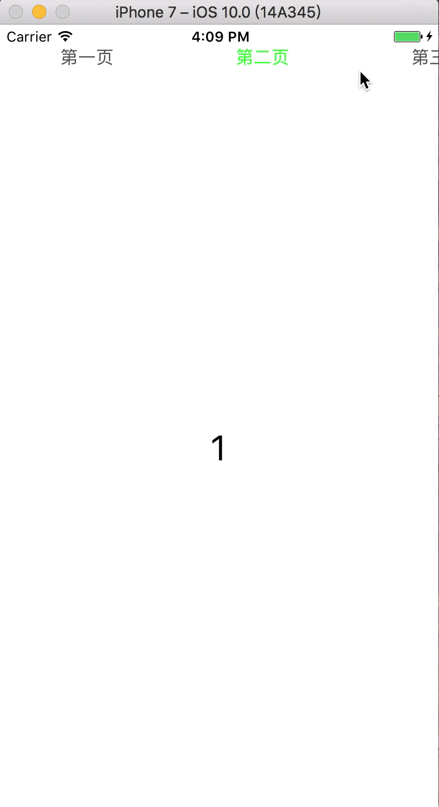
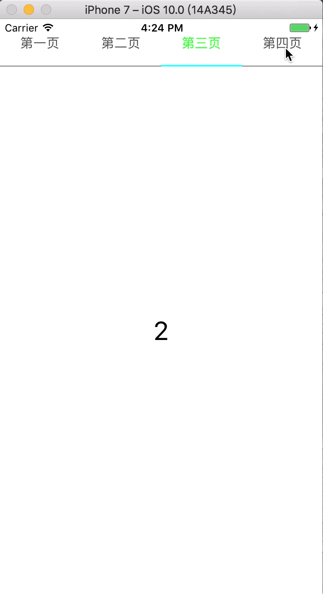

# ADSSegmentedButton-可滚动的菜单按钮栏
[](https://travis-ci.org/AndrewShen/ADSSegmentedButton)
[](http://cocoapods.org/pods/ADSSegmentedButton)
[](http://cocoapods.org/pods/ADSSegmentedButton)
[](http://cocoapods.org/pods/ADSSegmentedButton)

## 前言
项目中经常会有菜单分栏设计，因此写了一个控件方便项目使用。控件使用了Masonry进行自动布局，支持配置按钮样式，最小按钮宽度（可选）和下划线（可选）颜色

## 示例

- 如果不配置下划线则不显示下划线。
- 最小按钮宽度可以不指定，当按钮总长度小于等于设定的控件宽度时，则按照控件宽度布局按钮，此时不可滑动
- 指定按钮宽度后，如果按钮总长度大于设定控件宽度时，则按照设定按钮宽度布局，此时可以滑动

按钮总宽度大于屏幕宽度无下划线：


按钮总长度未超过屏幕宽度带下划线：


## 方法说明

### 方法初始化

初始化按钮，按钮标题为必传项。tag可不传，不设定则自动设置tag为0..n.最小按钮宽度可为0.

```
/**
 *  初始化一行按钮
 *
 *  @param arrayTitles        按钮标题
 *  @param arrayTags          按钮tag，可选，不设定则默认为0..n
 *  @param minimumButtonWidth   最小按钮宽度,可为0
 *
 */
- (instancetype)initWithTitles:(NSArray<NSString *> *)arrayTitles tags:(nullable NSArray<NSNumber *> *)arrayTags minimumButtonWidth:(CGFloat)minimumButtonWidth;
```

### 配置按钮样式-可选

配置按钮样式方法可选，不调用则使用默认样式。

```
/**
 配置按钮样式,方法可选

 @param normalTitleColor   正常状态颜色，默认蓝色
 @param selectedTitleColor 标题选中状态颜色，默认黑色
 @param font               标题字体，默认button字体
 */
- (void)configNormalTitleColor:(nullable UIColor *)normalTitleColor selectedTitleColor:(nullable UIColor *)selectedTitleColor titleFont:(nullable UIFont *)font;

```

### 配置下划线样式-可选

不调用此方法则不显示下划线。

```
/**
 配置底部线条样式，可选，不调用此方法则不显示下划线

 @param highlightLineColor   滚动线条颜色
 @param highlightLineHeight  滚动线条高度
 @param backgroundLineColor  背景线条颜色
 @param backgroundLineHeight 背景线条高度
 */
- (void)configBottomLineWithHighlightLineColor:(nullable UIColor *)highlightLineColor highlightLineHeight:(CGFloat)highlightLineHeight backgroundLineColor:(nullable UIColor *)backgroundLineColor backgroundLineHeight:(CGFloat)backgroundLineHeight;
```

### 主动选中某个按钮、

除了手动点击按钮选中外，还可通过代码主动选中按钮。

```
/**
 *  设置根据tag按钮选中
 *
 *  @param tag 选中按钮tag
 */
- (void)selectedButtonWithTag:(NSInteger)tag;
```

